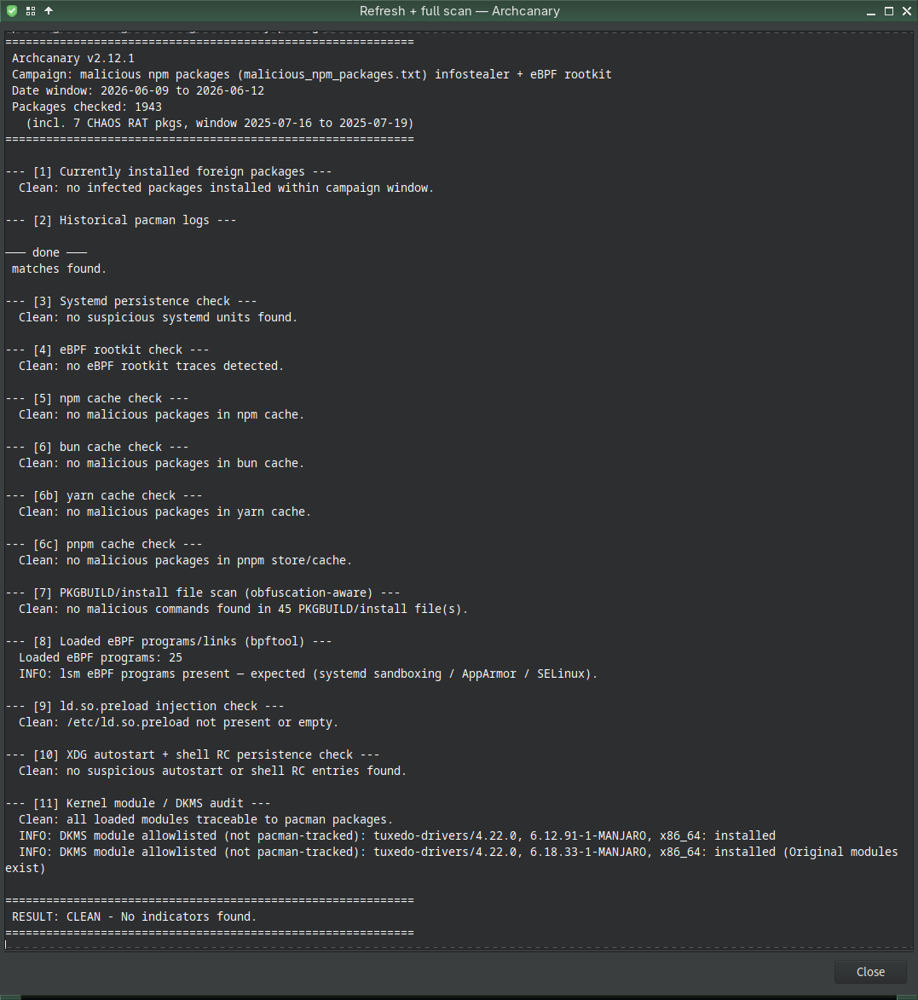
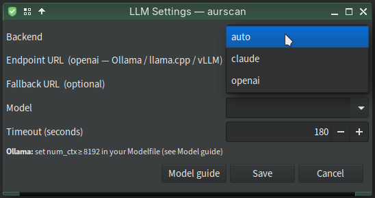

# archcanary

[](https://github.com/musqz/archcanary/releases)

> **BETA — under heavy development.** Expect breaking changes, rough edges, and incomplete docs. Designed and tested on Mabox Linux (Arch-based, Openbox). Use on other Arch derivatives at your own risk.

> **Read-only by design.** The scanner detects and reports — it never deletes, quarantines, or disables anything. Remediation is left to you. The only writes are its own logs and config lists. `install.sh`, `--refresh`, and the DKMS allowlist editor are the exceptions — all explicit.

> **Developed with Claude AI (Anthropic).** All AI-assisted code and documentation is reviewed by the developer before commit. Treat all detections as advisory, not authoritative.

---

## What is archcanary?

archcanary is a layered security detection stack for Arch Linux — scanning for malicious AUR packages, systemd/eBPF persistence, npm/bun cache poisoning, kernel module tampering, library injection, and more.

It started from [lenucksi/aur-malware-check](https://github.com/lenucksi/aur-malware-check) under the name **aur-malware-check**, originally focused on the June 2026 AUR supply-chain attack. As the tool grew to cover a much broader set of system checks — integrating a GUI frontend, automated systemd timers, and multiple detection layers — the scope outgrew the original name. LLM-based pre-install PKGBUILD scanning (via aurscan) is available as an optional add-on for users who want it; archcanary works fully without it and the GUI omits it when aurscan is not installed. It was renamed **archcanary** to reflect what it has become: a multi-tool for a complete Arch system security check.

The adaptations to the original are extensive enough that this is effectively a new tool that shares its roots with lenucksi/aur-malware-check rather than a simple patch set on top of it.

---

## Screenshots

<table>
<tr>
<td align="center" width="40%">
<br/>
<sub>Main menu — all checks passed</sub>
</td>
<td align="center" width="60%">
<br/>
<sub>Full scan output — 1943 packages checked, RESULT: CLEAN</sub>
</td>
</tr>
</table>

---

## Projects Used

archcanary integrates with and builds on the following:

| Project | Role |
|---------|------|
| [lenucksi/aur-malware-check](https://github.com/lenucksi/aur-malware-check) | Origin — the aur-malware-check script archcanary started from |
| [musqz/aurscan](https://github.com/musqz/aurscan) | LLM PKGBUILD scanner — Claude reads each PKGBUILD before `yay` builds; fork of [manticore-projects/aurscan](https://github.com/manticore-projects/aurscan), adapted to read `~/.config/aurscan/env` for archcanary GUI integration |
| [claude-code](https://claude.ai/download) | `claude` CLI — LLM backend used by aurscan to analyse PKGBUILDs (`curl -fsSL https://claude.ai/install.sh | bash`) |
| [traur](https://aur.archlinux.org/packages/traur) | Pre-install heuristic scanner — 279 signals across 5 weighted categories |
| [yay](https://github.com/Jguer/yay) 13.0 | AUR helper with Lua hook support (`~/.config/yay/init.lua`) — upgrade age warnings, offline pattern check, install log |
| [yad](https://github.com/v1cont/yad) | GTK dialog toolkit used by `archcanary-gui` |
| [bpftool](https://github.com/libbpf/bpftool) (pkg: `bpf`) | Enumerates all loaded eBPF programs for rootkit detection |
| [libnotify](https://gitlab.gnome.org/GNOME/libnotify) | `notify-send` — desktop critical alert on infected scan result |
| [polkit](https://gitlab.freedesktop.org/polkit/polkit) / pkexec | GUI privilege escalation for root-requiring checks |

### Detection Layers

```
User runs `aurscan <pkg>` before installing
    ├── static rules (offline) — known campaign signatures
    ├── Claude LLM reads PKGBUILD — novel/obfuscated patterns
    └── on CLEAN → user runs `yay -S pkg` / `yay -Syu`
            └── yay init.lua hooks
                            ├── UpgradeSelect  — warn if PKGBUILD modified < 3 days ago
                            ├── AURPreInstall  — offline pattern check
                            └── PostInstall    — logs AUR installs

systemd system timer (weekly + on boot + after each pacman tx)
    └── archcanary --full --all-time
            ├── known-bad package list (1900+ JS campaign + 83 Russian spam)
            ├── pacman.log history (compressed log support)
            ├── systemd persistence (services, drop-ins, timers)
            ├── eBPF rootkit traces + bpftool program enumeration
            ├── npm/bun/yarn/pnpm cache scan
            ├── PKGBUILD obfuscation patterns
            ├── ld.so.preload injection
            ├── XDG autostart + shell RC persistence
            └── kernel module / DKMS audit
                    └── writes /var/lib/archcanary/last-scan.log

systemd user path unit
    └── watches last-scan.log → notify-send critical alert on INFECTED

archcanary-gui (on-demand)
    └── yad grouped menu, per-session status, polkit for root checks
```

---

## Quick Start

```bash
# Check if you installed any compromised packages
archcanary

# Full scan — all checks (some require root)
sudo archcanary --full --all-time

# Check setup health
archcanary --doctor

# Refresh package list from the live HedgeDoc, then scan
archcanary --refresh --full --all-time

# GUI frontend (requires yad)
archcanary-gui

# Full scan in terminal — no GUI, structured summary output
archcanary-gui --no-gui
```

Every scan prints a per-check summary before the final verdict:

```
 Check summary
 ───────────────────────────────────────────────────────
 Package list (1943 pkgs)            ✅  clean
 pacman.log history                  ✅  clean
 Systemd persistence                 ✅  clean
 eBPF rootkit traces                 ✅  clean
 npm cache                           ✅  clean
 bun cache                           ✅  clean
 yarn cache                          ✅  clean
 pnpm cache                          ✅  clean
 PKGBUILD obfuscation scan           ✅  clean
 eBPF programs (bpftool)             ⚠   skipped (needs root)
 ld.so.preload injection             ✅  clean
 XDG autostart + shell RCs           ✅  clean
 Kernel modules (DKMS)               ⚠   skipped (needs root)
 ───────────────────────────────────────────────────────
============================================================
 RESULT: CLEAN - No indicators found.
============================================================
```

---

## Checks

| Flag | What it does | Root? |
|------|-------------|-------|
| *(default)* | Package list match against installed AUR packages | No |
| `--check-systemd` | Systemd persistence: unknown services, drop-ins, Restart= timers | No |
| `--check-ebpf` | eBPF rootkit traces (`/sys/fs/bpf/hidden_*`) | No |
| `--check-npm-cache` | npm cache for malicious package names | No |
| `--check-bun-cache` | bun cache for malicious package names | No |
| `--check-yarn-cache` | yarn cache scan | No |
| `--check-pnpm-cache` | pnpm cache + fnm per-version Node installs | No |
| `--check-pkgbuild` | AUR helper cache — obfuscation patterns (base64, eval, var-split, printf hex) | No |
| `--check-bpftool` | Enumerate all loaded eBPF programs via `bpftool`; flags stealth hook types | Yes |
| `--check-ldso` | `/etc/ld.so.preload` injection + recent `/etc/ld.so.conf.d/` changes | No |
| `--check-autostart` | `~/.config/autostart`, user systemd services, shell RC download-and-exec patterns | No |
| `--check-kmod` | Kernel modules not owned by pacman; untracked DKMS builds | Yes |
| `--full` | All of the above | Partial |
| `--all-time` | Skip the June 9-12 install-date window — scan all history | — |
| `--refresh` | Fetch the live package list from the Arch Linux HedgeDoc | — |
| `--doctor` | Health check: binary deps, systemd units, install paths | — |

### Exit Codes

| Code | Meaning |
|------|---------|
| 0 | Clean — no indicators found |
| 1 | Warnings (log scan issues, missing files) |
| 2 | Infected packages or artifacts detected |

---

## Installation

```bash
# User install — scripts, config seeding, desktop entry
./install.sh

# System install — adds root helper, polkit policy, systemd automated scan
./install.sh --system

# Uninstall
./install.sh uninstall --system
```

`--system` sets up:
- Root system timer: weekly + on boot + after each pacman transaction
- User notifier: watches `/var/lib/archcanary/last-scan.log`, fires a desktop alert on `INFECTED`
- pkexec root helper for GUI-triggered root checks (eBPF, bpftool, kmod)

See [docs/systemd.md](docs/systemd.md) for unit file details and [docs/my-setup.md](docs/my-setup.md) for the full personal stack and reinstall steps.

---

## LLM Settings (aurscan)

[aurscan](https://github.com/musqz/aurscan) scans PKGBUILDs with an LLM before `yay` builds them. The GUI exposes its backend configuration under **Utilities → LLM settings**.



| Field | Description |
|-------|-------------|
| Backend | `auto` — Claude if `ANTHROPIC_API_KEY` is set, else static rules only<br>`claude` — Claude API<br>`openai` — any OpenAI-compatible endpoint (Ollama, llama.cpp, vLLM) |
| Endpoint URL | URL for the `openai` backend, e.g. `http://localhost:11434/v1` |
| Fallback URL | Optional second endpoint — aurscan fails over automatically |
| Model | Model name sent to the endpoint |
| Timeout | Per-request budget in seconds — raise for slow CPU-only local models (default 180 s) |

Settings are saved to `~/.config/aurscan/env` and loaded by aurscan at startup. Explicit environment variables always override the file.

The **Model guide** button in the dialog shows local model size recommendations and the critical Ollama `num_ctx` warning (Ollama defaults to 2048 which silently truncates the PKGBUILD — set ≥ 8192).

---

## Campaigns Detected

### JS Supply-Chain Attack (June 9–12, 2026)

Attackers used commit forgery to impersonate AUR maintainers, injecting malicious `npm`/`bun` install hooks into 1600+ package PKGBUILDs. Payload: an infostealer and eBPF rootkit.

**What it steals:** Discord tokens, GitHub PATs, npm/Slack/Teams sessions, SSH keys, Vault tokens, Docker credentials, browser cookies — exfiltrated via `temp.sh` and a Tor C2.

**Persistence:** systemd services with `Restart=always`; eBPF rootkit hides processes, files, and socket inodes when run as root with CAP_BPF.

Two waves:
- **Wave 1 (npm)** — `atomic-lockfile` / `lockfile-js`; accounts `krisztinavarga`, `franziskaweber`, `tobiaswesterburg`, `ellenmyklebust`. Note: `arojas` was impersonated via git commit forgery — he is a legitimate KDE maintainer ([clarification](https://chaos.social/@dvzrv/116736017948300691)).
- **Wave 2 (bun)** — `js-digest`; accounts `custodiatovar`, `veramagalhaes`.

### Russian Spam Campaign (June 14, 2026)

A separate campaign ([reported by Sid Karunaratne](https://lists.archlinux.org/archives/list/aur-general@lists.archlinux.org/message/2YQSHTC27MOKDDKHZTH2BJGTEN2CYC7W/)) in which 83 AUR package PKGBUILDs were modified to inject Russian-language spam `echo` statements into `~/.bashrc`, `~/.zshrc`, and other shell configs at install time. No credential theft or persistence — nuisance/propaganda payload. Reported to Arch DevOps; cleanup was in progress as of 2026-06-14.

archcanary detects these via `malicious_russian_spam_packages.txt` (shown in the scan header alongside the JS campaign count).

---

## What to Do If Infected

1. **Preserve the system** — do not power off; use forensic acquisition from trusted media
2. **Rotate all credentials** — Discord, GitHub, npm, Slack, Teams, SSH keys, Vault tokens, cloud keys
3. **Check for persistence** — `systemctl list-units --type=service --state=running`; run `--check-systemd`
4. **Check for eBPF rootkit** — `ls -la /sys/fs/bpf/hidden_*`; run `sudo archcanary --check-bpftool`
5. **Check for library injection** — `cat /etc/ld.so.preload`; run `archcanary --check-ldso`
6. **Check for user-space persistence** — run `archcanary --check-autostart`
7. **Check for rogue kernel modules** — run `sudo archcanary --check-kmod`
8. **Clean from trusted media** — boot from Arch ISO, mount filesystem, remove malicious units
9. **Consider reinstallation** — the rootkit makes the system untrustworthy once active
10. **Report** — https://lists.archlinux.org/archives/list/aur-general@lists.archlinux.org/

---

## Documentation

- [docs/overview.md](docs/overview.md) — lifecycle diagram, at-a-glance table
- [docs/systemd.md](docs/systemd.md) — systemd unit files and automated scan setup
- [docs/my-setup.md](docs/my-setup.md) — full personal stack, component connections, reinstall steps
- [docs/false-positives.md](docs/false-positives.md) — documented benign signals and how to verify
- [SOURCES.md](SOURCES.md) — full numbered source references

---

## Attribution

Community detection scripts this consolidates:

| Author | Contribution |
|--------|-------------|
| [Kidev](https://gist.github.com/Kidev/59bf9f5fb53ab5eee99f19a6a2fc3992) | Original foundation: package list (~446 entries), basic `pacman -Qi` loop |
| [BrianCArnold](https://gist.github.com/BrianCArnold/beb514ffc95a9a251b0dc2f767471fca) | Efficiency: `pacman -Qm` piped through grep |
| [commonsourcecs](https://cscs.pastes.sh/aurvulntest20260611.sh) | Batch `pacman -Qmq`, date window filtering, expanded list |
| [Kacper-Kondracki](https://gist.github.com/Kacper-Kondracki/88c5b313f79cc1f9c347e7ed61a36d10) | `pacman.log` historical scanning, compressed log support, configurable date window |
| [quantenProjects](https://gist.github.com/quantenProjects/3f768dce7331618310f016d975bf8547) | Safe `comm -1 -2` one-liner approach |
| drbbgh (upstream PR #8) | `--refresh` flag — live package list from Arch Linux HedgeDoc |
| liphiwolf (upstream PR #7) | `lockfile-js` detection, expanded package list |

Full source list with URLs: [SOURCES.md](SOURCES.md).

---

## License

Community tools — no warranty. Use at your own risk.
