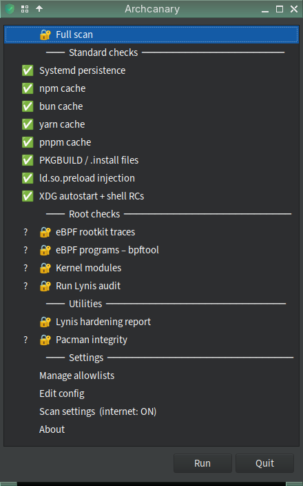

# archcanary

[](https://github.com/musqz/archcanary/releases)

> **BETA — actively seeking testing and feedback.** Expect rough edges and incomplete docs as we finetune and fix bugs.
> Primarily developed and tested on Mabox Linux (Arch-based, Openbox). Testing on Manjaro and other Arch derivatives is in progress — it should work fine.
> The beta label is staying on deliberately for now, to give the project a solid stretch of real-world testing rather than dropping it early — not a sign of unresolved blockers.
>
> If you run into anything, please open an [issue](https://github.com/musqz/archcanary/issues) or start a [discussion](https://github.com/musqz/archcanary/discussions).
>
> Follow active topic on [endeavouros forum](https://forum.endeavouros.com/t/archcanary-a-layered-security-scanner-for-arch-based-linux-beta-looking-for-testers/80837) about archcanary.

> **Read-only by design.** The scanner detects and reports — it never deletes, quarantines, or disables anything.
> Remediation is left to you. The only writes are its own logs and config lists. `install.sh`, `--refresh`, and the allowlist editors (DKMS, systemd, bpftool) are the exceptions — all explicit.

> **Developed with Claude AI (Anthropic).** All AI-assisted code and documentation is reviewed by the developer before commit. Treat all detections as advisory, not authoritative.

---

## What is archcanary?

Archcanary is a layered security detection stack for Arch Linux — scanning for malicious AUR packages, systemd/eBPF persistence, npm/bun cache poisoning, kernel module tampering, library injection, and more.

It started from [lenucksi/aur-malware-check](https://github.com/lenucksi/aur-malware-check) under the name **aur-malware-check**, originally focused on the June 2026 AUR supply-chain attack. 
As the tool grew to cover a much broader set of system checks — integrating a GUI frontend, automated systemd timers, and multiple detection layers — the scope outgrew the original name. 

---

## Quick Start

```bash
# Check if you installed any compromised packages
archcanary

# Full scan — all checks (some require root)
sudo archcanary --full

# Check setup health
archcanary --doctor

# Refresh package list from the live HedgeDoc, then scan
archcanary --refresh --full

# GUI frontend (requires yad)
archcanary-gui

# Full scan in terminal — no GUI, structured summary output
archcanary-gui --no-gui
```

Every scan prints a per-check summary before the final verdict:

```
 Check summary
 ───────────────────────────────────────────────────────
 [1]  Package list (2506 pkgs)             ✅  clean
 [2]  pacman.log history                   ✅  clean
 [3]  Systemd persistence                  ✅  clean
 [4]  eBPF rootkit traces                  ✅  clean
 [5]  npm cache                            ✅  clean
 [6]  bun cache                            ✅  clean
 [6b] yarn cache                           ✅  clean
 [6c] pnpm cache                           ✅  clean
 [7]  PKGBUILD obfuscation scan            ✅  clean
 [8]  eBPF programs (bpftool)              ✅  clean
 [9]  ld.so.preload injection              ✅  clean
 [10] XDG autostart + shell RCs            ✅  clean
 [11] Kernel modules (DKMS)                ✅  clean
 [12] Lynis hardening                      ✅  clean
 [13] Package integrity                    ✅  clean
 ───────────────────────────────────────────────────────
============================================================
 RESULT: CLEAN - No indicators found.
============================================================
```

With `archcanary --refresh`, the banner also shows each list's count and how
much it changed since the last run — handy for noticing a threat-intel feed
just grew:

```
============================================================
 Archcanary v0.1.20
 Scanned: 2026-08-01 16:14

 Lists loaded
   package_list.txt  infostealer + eBPF rootkit  1936 pkgs
   + CHAOS RAT         7 pkgs
   + Russian Spam     75 pkgs
   + aur-audit black 101 pkgs (+17)
   + aur-audit red   306 pkgs (+27)
   + extra: archlinux-list.txt    68 pkgs

 Packages checked: 2493
============================================================
```

---

## Screenshots

<table>
<tr>
<td align="center" width="40%">
<br/>
<sub>Main menu — all checks passed</sub>
</td>
</tr>
</table>

---

## Checks

Every optional check is off by default — bare `archcanary` just matches your
installed packages against the known-bad lists. Enable more with flags, or
run everything at once with `--full`.

<details>
<summary><strong>Full flag reference</strong> (click to expand)</summary>

| Flag | What it does | Root? |
|------|-------------|-------|
| *(default)* | Package list match against installed AUR packages | No |
| `--check-systemd` | Systemd persistence: unknown services, drop-ins, Restart= timers | No |
| `--check-ebpf` | eBPF rootkit traces (`/sys/fs/bpf/hidden_*`) | No |
| `--check-npm-cache` | npm cache for malicious package names | No |
| `--check-bun-cache` | bun cache for malicious package names | No |
| `--check-yarn-cache` | yarn cache scan | No |
| `--check-pnpm-cache` | pnpm cache + fnm per-version Node installs | No |
| `--check-pkgbuild` | AUR helper cache — obfuscation patterns (base64, eval, var-split, printf hex, ANSI-C hex/octal, rev/tr pipe-to-shell) and undocumented ELF binaries actually committed to a package's own AUR git tree (not just downloaded by makepkg — a -bin package's own source binary sitting in the build dir is not flagged) | No |
| `--check-bpftool` | Enumerate loaded eBPF programs (stealth types), perf/kprobe attachments with owning PID and hooked function, XDP/TC network attachments | Yes |
| `--check-ldso` | `/etc/ld.so.preload` injection + recent `/etc/ld.so.conf.d/` changes | No |
| `--check-autostart` | `~/.config/autostart`, user systemd services, shell RC download-and-exec patterns | No |
| `--check-kmod` | Kernel modules not owned by pacman; untracked DKMS builds | Yes |
| `--check-lynis` | Read last Lynis report — hardening index, warnings, scan date | Yes |
| `--run-lynis` | Run `lynis audit system`, stream output | Yes |
| `--check-pkginteg` | Verify installed file checksums via `pacman -Qkk`. Reports SHA256 mismatches on non-backup, non-factory files. Backup files (pacman-managed configs expected to diverge) and `/factory/` paths are filtered out. Prioritise hits in `/usr/bin/`, `/usr/lib/`, `/usr/sbin/`. | Yes |
| `--check-list-overlap` | A note, not a warning: custom (`--extra-list`) entries already covered by an official list are grouped by file, with a ready-to-run `sed` command to remove them — safe to remove, since the official list is authoritative. Never affects the exit code or the check summary, and not included in `--full`. Also reachable from the GUI: Edit config → List overlap check. | No |
| `--scan-all-homes` | Enumerate real local users (UID range from `/etc/login.defs`, valid shell, home dir exists) and run the npm/bun/yarn/pnpm/pkgbuild/autostart checks against each of their homes, not just yours — privilege-dropped per user via `sudo -u`. For shared/multi-user machines; not included in `--full`. | Yes |
| `--search-packages=PKG[,PKG...]` | Check package name(s) against every loaded threat list, independent of what's installed — no scan, prints a ready-to-copy `pacman -Rns` command for any match, and exits. | No |
| `--full` | All of the above except `--check-list-overlap` and `--scan-all-homes` | Partial |
| `--refresh` | Fetch the live package list from the Arch Linux HedgeDoc, plus the supplementary npm/CHAOS RAT/Russian Spam/Community Reports lists and the aur-audit black/red feed | — |
| `--no-aur-audit` | Skip the aur-audit.wtako.net feed on `--refresh`. Persists via `AUR_AUDIT_ENABLE=false` in `~/.config/archcanary/env`, also toggleable from the GUI's Scan settings menu row | — |
| `--verbose`, `-v`, `--debug` | Verbose output (`--debug` also enables `set -x`) | — |
| `--log-file=PATH` | Write the full detail log to `PATH` (default: `~/.cache/archcanary/aur-check-<date>.log`) | — |
| `--package-list=PATH` | Override the infected AUR package list | — |
| `--malicious-npm-list=PATH` | Override the malicious npm package name list | — |
| `--chaos-rat-list=PATH` | Override the CHAOS RAT (2025) package list | — |
| `--russian-spam-list=PATH` | Override the Russian Spam Campaign (2026) list | — |
| `--community-list=PATH` | Override the community-reported package list | — |
| `--extra-list=PATH_OR_URL` | Load an additional package list (file or `https://` URL); repeatable | — |
| `--start-date=YYYY-MM-DD` | Only flag packages installed on or after this date (env: `START_DATE`) | — |
| `--end-date=YYYY-MM-DD` | Only flag packages installed on or before this date (env: `END_DATE`) | — |
| `--no-notify` | Suppress the desktop notification on detection | — |
| `--no-summary` | Suppress the check summary table at the end of a scan | — |
| `--color=auto\|always\|never` | Control symbol/color output (default: `auto`; also obeys `NO_COLOR` env) | — |
| `--format=text\|json` | Output a JSON summary instead of the human-readable report | — |
| `--doctor` | Health check: binary deps, systemd units, install paths | — |
| `--doctor=SECTION[,...]` | Check only the named section(s) with extra detail (`platform`, `deps`, `user`, `system`, `systemd`, `external`; tool names like `paru`/`yad` also map to a section) | — |
| `--allowlist-list=NAME` | List entries in an allowlist and exit (`NAME`: `dkms`, `systemd`, `bpftool`, `autostart`) | No |
| `--allowlist-add=NAME:VALUE` | Add `VALUE` to an allowlist and exit | Yes |
| `--allowlist-remove=NAME:VALUE` | Remove `VALUE` from an allowlist and exit | Yes |
| `--extra-lists-list` | List `~/.config/archcanary/extra_lists.conf` entries and exit | No |
| `--extra-lists-add=VALUE` | Add a path/URL to `extra_lists.conf` and exit | No |
| `--extra-lists-remove=VALUE` | Remove a path/URL from `extra_lists.conf` and exit | No |
| `--aur-audit-status` | Print the aur-audit.wtako.net feed setting (`true`/`false`) and exit | No |
| `--aur-audit-enable` | Enable the aur-audit.wtako.net feed on `--refresh` | No |
| `--aur-audit-disable` | Disable the aur-audit.wtako.net feed on `--refresh` | No |
| `--audit-rules-get` | Print the auditd rules file and exit | No |
| `--audit-rules-set` | Read new auditd rules from stdin and save | Yes |
| `--lynis-config-get` | Print the Lynis custom profile and exit | No |
| `--lynis-config-set` | Read a new Lynis custom profile from stdin and save | Yes |
| `--version`, `-V` | Show version and exit | — |
| `--help`, `-h` | Show this help and exit | — |

Both `install.sh` and the AUR package install bash tab-completion for every flag above (`archcanary --<TAB>`), loaded automatically via the `bash-completion` package — no `.bashrc` edits needed. If you'd rather type `canary`, add `alias canary=archcanary` to your `.bashrc`/`.zshrc`; the completion is already registered for that name too, so it works immediately.

</details>

### Lynis on a desktop system

Lynis was originally built for server hardening, so a chunk of its
"Suggestions" count doesn't apply to a single-user desktop (mail-relay ACLs,
multi-user auditing policy, firewall rules for exposed services). Don't treat
the suggestion count as a to-do list to clear to zero.

That said, plenty of its checks are just as relevant on a desktop: kernel
`sysctl` hardening (ASLR, `kptr_restrict`, `ptrace_scope`), file-permission
audits (world-writable files, SUID/SGID binaries), a GRUB bootloader password
(arguably more relevant on a laptop than a rack-mounted server — physical
access is the bigger threat model), outdated/vulnerable packages, and
PAM/login policy. archcanary includes Lynis for those overlaps, not because
this is a server tool bolted on — read the suggestions, skip the ones that
don't apply to your setup.

### Exit Codes

| Code | Meaning |
|------|---------|
| 0 | Clean — no indicators found |
| 1 | Warnings (log scan issues, missing files) |
| 2 | Infected packages or artifacts detected |

---

## Installation

```bash
# User install — scripts, config seeding, desktop entry
./install.sh

# System install — adds root helper, polkit policy, systemd automated scan
./install.sh --system

# Uninstall
./install.sh uninstall --system

# man page
man archcanary
```

`--system` needs `sudo`, but funnels every root-only step through a single script (`lib/archcanary-root-install.sh`) rather than calling `sudo` per-command. If your sudoers is restricted to a command allowlist instead of full access, you only need to permit that one script:
```
youruser yourhostname=(root) /usr/bin/bash /path/to/archcanary/lib/archcanary-root-install.sh *
```
`yourhostname` is this machine's hostname (`hostname` to check) — scopes the rule to this host specifically, tighter than `ALL` for a single-machine sudoers entry. Use `ALL` only if the same sudoers config is deployed across multiple hosts.

`--system` (and, equivalently, installing the built package via `makepkg -si` or an AUR helper) sets up:
- Root system timer: weekly + on boot + after each pacman transaction
- User notifier: watches `/var/lib/archcanary/last-scan.log`, fires a desktop alert on `INFECTED`
- pkexec root helper for GUI-triggered root checks (eBPF, bpftool, kmod, Lynis)
- auditd ruleset at `/etc/audit/rules.d/30-archcanary.rules` when auditd is installed (seeded from template, editable via GUI)
- `archcanary-scan-all-homes.timer`, opt-in and disabled by default (see below) — covers other local users' home checks that the per-user timer only covers for whoever enables it themselves

**Neither install path enables the timers automatically** — activation is always a manual, explicit step:

```bash
# Root system timer (weekly + on boot + after each pacman transaction)
sudo systemctl enable --now archcanary.timer archcanary.path

# User-scope scan and desktop notifier
systemctl --user enable --now archcanary-user.timer archcanary-notify.path

# Optional, machine-wide: weekly scan of every other real local user's home
# too, not just yours (see --scan-all-homes above) — off by default even
# after --system install, since it touches every local user's data
sudo systemctl enable --now archcanary-scan-all-homes.timer
```

Until you run these, `archcanary --doctor` will correctly show `[WARN]` for all four automation entries — that's expected, not a bug. Re-run `--doctor` after enabling to confirm they flip to `[ OK ]`.

See [docs/systemd.md](docs/systemd.md) for unit file details and [docs/my-setup.md](docs/my-setup.md) for the full personal stack and reinstall steps.

---

## Projects Used

archcanary integrates with and builds on the following — see
[docs/my-setup.md § Components](docs/my-setup.md#components) for what each one
does and how it's wired in:

| Project | Required |
|---------|----------|
| [yay](https://github.com/Jguer/yay) 13.0 | Optional |
| [paru](https://github.com/Morganamilo/paru) | Optional |
| [yad](https://github.com/v1cont/yad) | GUI only |
| [noto-fonts-emoji](https://archlinux.org/packages/extra/any/noto-fonts-emoji/) | GUI only (🔐 icons) |
| [bpftool](https://github.com/libbpf/bpftool) (pkg: `bpf`) | Optional (`--check-bpftool`) |
| [libnotify](https://gitlab.gnome.org/GNOME/libnotify) | Optional |
| [polkit](https://gitlab.freedesktop.org/polkit/polkit) / pkexec | GUI + `--system` install |
| [lynis](https://cisofy.com/lynis/) | Optional |
| [audit](https://people.redhat.com/sgrubb/audit/) / auditd | Optional |

Started from [lenucksi/aur-malware-check](https://github.com/lenucksi/aur-malware-check) — see [Attribution](#attribution) below.

### Detection Layers

An automatic layer fires at AUR build time — yay's offline `init.lua` hooks,
or paru's native `PreBuildCommand` hook, whichever AUR helper you use — plus
a continuous root scan (`archcanary --full`, weekly + on boot + after every
pacman transaction), a desktop notifier on detection, and the on-demand GUI.
paru's hook fires before its own diff/edit review menus (a paru limitation —
it has no post-review hook point) and only runs the PKGBUILD pattern check,
not the aur-audit black/red lookup, so yay's integration is the more
complete of the two. Other AUR helpers can still be scanned manually via
`--check-pkgbuild`, just without an automatic pre-build hook.

See [docs/overview.md](docs/overview.md) for the full lifecycle diagram
(at-a-glance table included).

---

## Campaigns Detected

### JS Supply-Chain Attack (June 9–12, 2026)

Attackers used commit forgery to impersonate AUR maintainers, injecting malicious `npm`/`bun` install hooks into 1600+ package PKGBUILDs. Payload: an infostealer and eBPF rootkit.

**What it steals:** Discord tokens, GitHub PATs, npm/Slack/Teams sessions, SSH keys, Vault tokens, Docker credentials, browser cookies — exfiltrated via `temp.sh` and a Tor C2.

**Persistence:** systemd services with `Restart=always`; eBPF rootkit hides processes, files, and socket inodes when run as root with CAP_BPF.

Three waves:
- **Wave 1 (npm)** — `atomic-lockfile` / `lockfile-js`; accounts `krisztinavarga`, `franziskaweber`, `tobiaswesterburg`, `ellenmyklebust`. Note: `arojas` was impersonated via git commit forgery — he is a legitimate KDE maintainer ([clarification](https://chaos.social/@dvzrv/116736017948300691)).
- **Wave 2 (bun)** — `js-digest`; accounts `custodiatovar`, `veramagalhaes`.
- **Wave 3 (obfuscated bun)** — June 14, 2026; Node.js packages, Plasma 6 applets, Firefox packages, Aura browser, LibreWolf extensions, NeoVim plug-ins. More elaborate obfuscation around the `bun` command; discovered by a821 and Nicolas Boichat (using a local Gemma E2B AI model). ([Phoronix](https://www.phoronix.com/news/Arch-Linux-AUR-More-Malware))

### Russian Spam Campaign (June 14, 2026)

A separate campaign ([reported by Sid Karunaratne](https://lists.archlinux.org/archives/list/aur-general@lists.archlinux.org/message/2YQSHTC27MOKDDKHZTH2BJGTEN2CYC7W/)) in which 75 AUR package PKGBUILDs were modified to inject Russian-language spam `echo` statements into `~/.bashrc`, `~/.zshrc`, and other shell configs at install time. No credential theft or persistence — nuisance/propaganda payload. Reported to Arch DevOps; cleanup was in progress as of 2026-06-14.

archcanary detects these via `malicious_russian_spam_packages.txt` (shown in the scan header alongside the JS campaign count).

### Community Reports

A hand-curated list (`community_reports.txt`), sourced from AUR malware reports shared by the community — refreshed the same way as the lists above, no separate opt-in needed. Unlike the campaign-specific lists, this one has no fixed scope or end date; it's an ongoing collection point for individually-reported packages that don't (yet) belong to a documented campaign. Hits are annotated `[community report]` so you can tell the source. Maintained directly in this repo — see [CONTRIBUTING.md](CONTRIBUTING.md) to report a package, or [SOURCES.md](SOURCES.md) for the trust basis.

### aur-audit.wtako.net feed

`--refresh` also syncs the black/red package lists published by the third-party [aur-audit.wtako.net](https://wtako.net/services/aur-audit) service, which continuously scans all of AUR and publishes verdicts via a free, unauthenticated API. Black (confirmed malicious) and red (high-risk) hits are merged into the same infected-package check as the lists above, annotated `[aur-audit: black]` / `[aur-audit: red]` so you can tell the source of a hit. Yellow (minor/qualitative findings) is intentionally not synced — too noisy for an automated check. For historical `pacman.log` matches specifically, the check correlates against the flagged version's own AUR publish date (also synced on `--refresh`) rather than applying today's live verdict to an install from any point in the past — a 5-year-old install of a name that's currently flagged doesn't get treated the same as a recent one.

**On trusting it:** this is an independent, pseudonymous operator's project ("Saren" / wtako.net), not a security vendor — neither the site nor its API docs publish a scanning methodology or a track record, so there's nothing to verify the operator's credentials against. The trust here is in the integration, not the operator: the API is free, unauthenticated, and read-only (nothing about your system is ever sent to it), its hits are merged alongside archcanary's own sourced/cited lists rather than replacing them (see [SOURCES.md](SOURCES.md#9-aur-auditwtakonet-feed)), and the source is always visible in the `[aur-audit: black/red]` annotation. Treat it like any heuristic scanner: best-effort, not a guarantee.

The same synced lists also gate installs directly: yay's `AURPostDownload` hook (see [yay 13.0 integration](docs/my-setup.md#yay-130-integration)) checks the black/red list itself and aborts on a black hit, warns on a red hit — a pre-build check that needs no LLM. This one's yay-only for now — paru's [`PreBuildCommand` hook](docs/my-setup.md#paru-integration) runs `archcanary --check-pkgbuild` before every build, which covers the same PKGBUILD obfuscation patterns as yay's hook, but not this aur-audit lookup. A black abort is a blocking action driven by this unverified third-party source; there's no per-source toggle, so the only way to opt out is to stop running `--refresh` (or delete `aur_audit_black.txt`/`aur_audit_red.txt` from `~/.config/archcanary/`), which makes both the hook and the scan-side check silently skip it.

The GUI's "Scan settings" checkbox is framed as "I have an internet connection" rather than an aur-audit-specific toggle — turning it off also stops Full scan from attempting `--refresh` at all, not just the aur-audit sync (CLI users are unaffected: `--no-aur-audit`/`--aur-audit-enable`/`--aur-audit-disable` still work exactly as documented above, since typing `--refresh` yourself already implies you know whether you have a connection). Turning it off only stops *refreshing* `aur_audit_black.txt`/`aur_audit_red.txt` — it doesn't delete files already fetched, so the yay hook keeps using whatever was last synced, indefinitely, with no signal that the data may now be stale.

---

## What to Do If Infected

1. **Preserve the system** — do not power off; use forensic acquisition from trusted media
2. **Rotate all credentials** — Discord, GitHub, npm, Slack, Teams, SSH keys, Vault tokens, cloud keys
3. **Check for persistence** — `systemctl list-units --type=service --state=running`; run `--check-systemd`
4. **Check for eBPF rootkit** — `ls -la /sys/fs/bpf/hidden_*`; run `sudo archcanary --check-bpftool`
5. **Check for library injection** — `cat /etc/ld.so.preload`; run `archcanary --check-ldso`
6. **Check for user-space persistence** — run `archcanary --check-autostart`
7. **Check for rogue kernel modules** — run `sudo archcanary --check-kmod`
8. **Clean from trusted media** — boot from Arch ISO, mount filesystem, remove malicious units
9. **Consider reinstallation** — the rootkit makes the system untrustworthy once active
10. **Report** — https://lists.archlinux.org/archives/list/aur-general@lists.archlinux.org/

---

## Documentation

- [docs/overview.md](docs/overview.md) — lifecycle diagram, at-a-glance table
- [docs/reading-pkgbuilds.md](docs/reading-pkgbuilds.md) — how to review a PKGBUILD yourself, for beginners — what a normal one looks like, real red flags from real attacks
- [docs/systemd.md](docs/systemd.md) — systemd unit files and automated scan setup
- [docs/my-setup.md](docs/my-setup.md) — full personal stack, component connections, reinstall steps
- [CONTRIBUTING.md](CONTRIBUTING.md) — how to report a malicious/suspicious AUR package
- [SOURCES.md](SOURCES.md) — full numbered source references

---

## Attribution

Community detection scripts this consolidates:

| Author | Contribution |
|--------|-------------|
| [Kidev](https://gist.github.com/Kidev/59bf9f5fb53ab5eee99f19a6a2fc3992) | Original foundation: package list (~446 entries), basic `pacman -Qi` loop |
| [BrianCArnold](https://gist.github.com/BrianCArnold/beb514ffc95a9a251b0dc2f767471fca) | Efficiency: `pacman -Qm` piped through grep |
| [commonsourcecs](https://cscs.pastes.sh/aurvulntest20260611.sh) | Batch `pacman -Qmq`, date window filtering, expanded list |
| [Kacper-Kondracki](https://gist.github.com/Kacper-Kondracki/88c5b313f79cc1f9c347e7ed61a36d10) | `pacman.log` historical scanning, compressed log support, configurable date window |
| [quantenProjects](https://gist.github.com/quantenProjects/3f768dce7331618310f016d975bf8547) | Safe `comm -1 -2` one-liner approach |
| drbbgh (upstream PR #8) | `--refresh` flag — live package list from Arch Linux HedgeDoc |
| liphiwolf (upstream PR #7) | `lockfile-js` detection, expanded package list |

Full source list with URLs: [SOURCES.md](SOURCES.md).

---

## License

Community tools — no warranty. Use at your own risk.
