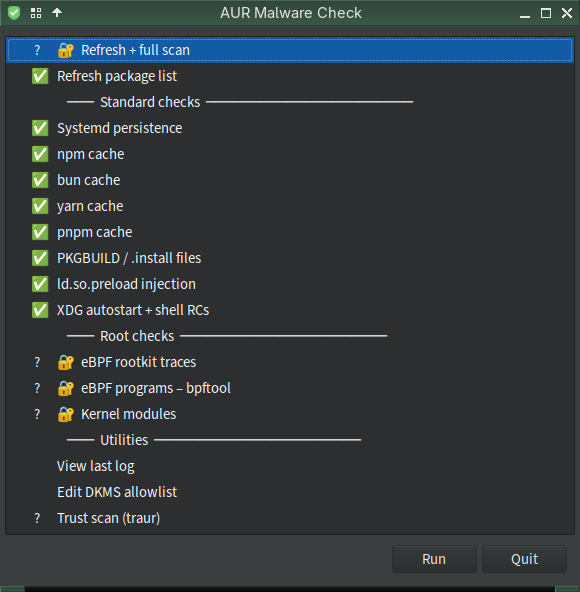

# Personal setup — Mabox Linux

Full overview of how this tool is deployed and how the pieces connect.

> For a one-screen visual map (lifecycle diagram + at-a-glance table) start with
> [overview.md](overview.md). This page is the deep reference.

## Components

| Component | Package / Source | Purpose |
|-----------|-----------------|---------|
| `archcanary` | [musqz/archcanary](https://github.com/musqz/archcanary) (started from [lenucksi/aur-malware-check](https://github.com/lenucksi/aur-malware-check)) | Main scanner — known-bad packages, pacman logs, systemd persistence (incl. drop-ins + timers), eBPF rootkit, npm/bun/yarn/pnpm cache, PKGBUILD obfuscation (incl. base64/eval/printf/varsplit), loaded-eBPF enumeration (`bpftool`), `ld.so.preload` injection, XDG autostart + shell RC persistence, kernel module / DKMS audit. Prints a per-check summary table at the end of every scan. |
| `archcanary-gui` | [musqz/archcanary](https://github.com/musqz/archcanary) | yad GUI — grouped menu with per-session status column (✅/⚠/❌/?), polkit auth for root checks, streaming output window. `--no-gui` bypasses yad and runs a full scan in the terminal with the structured summary. |
| `traur` | [AUR: traur](https://aur.archlinux.org/packages/traur) | Trust scanner — 279 signals across PKGBUILD static analysis (reverse shells, download-and-execute, obfuscation, exfiltration), maintainer behaviour (new account, orphan takeover, typosquatting), AUR metadata (votes, popularity, orphaned), and git history (major rewrites, checksum removal, source domain changes). Runs **automatically as a pacman PreTransaction hook** (`/usr/share/libalpm/hooks/traur.hook` → `traur-hook`, `AbortOnFail`) on every install/upgrade — including repo packages — and is also runnable by hand (`traur scan <pkg>`) |
| `aurscan` | [AUR: aurscan-manticore-git](https://aur.archlinux.org/packages/aurscan-manticore-git) ([manticore-projects/aurscan](https://github.com/manticore-projects/aurscan)) | LLM-based PKGBUILD scanner using Claude. Wired into yay as its **editor-gate** (`config.json` `editor=aurscan-gate` + `editmenu=true`): yay invokes it on each AUR PKGBUILD before building, so every `yay` build (and AUR dependency) is scanned transparently — a non-CLEAN verdict exits non-zero and aborts the build. Still runnable standalone (`aurscan <pkg>`). Requires the `claude` CLI (`@anthropic-ai/claude-code`) as its LLM backend |
| `yay` 13.0 `init.lua` | `~/.config/yay/init.lua` | yay 13.0 Lua hooks — an independent offline layer that also runs on every build: upgrade-age warning (`UpgradeSelect`), malicious-pattern block (`AURPreInstall`), and AUR install logging (`PostInstall`) |
| `yad` | official repos | GTK dialog toolkit used by `archcanary-gui` |
| `polkit` / `pkexec` | official repos | Graphical privilege escalation for root-requiring checks (eBPF, kmod) in the GUI |
| `libnotify` | official repos | Provides `notify-send` — the desktop notification on exit code 2 |
| `bpftool` | `bpf` — official repos | Enumerates loaded eBPF programs for `--check-bpftool` |

## How the pieces connect

```
systemd SYSTEM timer (weekly + on boot, runs as root)
    └── archcanary --refresh --full --no-notify
            ├── [1]  currently installed foreign packages
            ├── [2]  historical pacman logs
            ├── [3]  systemd persistence (services, drop-ins, timers)
            ├── [4]  eBPF rootkit traces (/sys/fs/bpf/hidden_*)
            ├── [5]  npm cache
            ├── [6]  bun cache
            ├── [6b] yarn cache
            ├── [6c] pnpm cache
            ├── [7]  PKGBUILD / install file scan (obfuscation-aware)
            ├── [8]  loaded eBPF programs via bpftool (stealth hook types)
            ├── [9]  ld.so.preload injection
            ├── [10] XDG autostart + shell RC persistence
            └── [11] kernel module / DKMS audit          (root → actually runs)
                    │
                    └── writes /var/lib/archcanary/last-scan.log
                            │
   systemd USER path unit watches that file
            └── on "RESULT: INFECTED" → notify-send (libnotify) → critical desktop alert
                    └── open Archcanary from the app launcher to review

archcanary-gui (on-demand — desktop shortcut or app launcher)
    └── yad list menu with per-session status column
            ├── standard checks run as user
            └── root checks (eBPF, bpftool, kmod) → pkexec → polkit auth → root-helper
                    └── streams output live, updates status on close

traur — runs three ways:
    ├── pacman PreTransaction hook (automatic — installed by the traur package)
    │       └── /usr/share/libalpm/hooks/traur.hook → traur-hook   (AbortOnFail)
    │               └── trust-scores every pacman install/upgrade (incl. repo pkgs);
    │                   a failing score aborts the transaction before install
    │
    ├── GUI "Trust scan (traur)"  → traur scan  (no args)
    │       └── bulk audit of ALL installed AUR packages
    │               └── useful as a periodic sweep alongside archcanary
    │
    └── terminal: traur scan <pkg>  (manually vet a package before installing)
            └── 279 signals, 5 weighted categories
                    ├── Pkgbuild (0.45)   — static analysis: shells, download-exec, obfuscation, exfil, miners
                    ├── Behavioral (0.25) — maintainer: new account, batch creation, orphan takeover, typosquat
                    ├── Metadata (0.15)   — AUR page: votes, popularity, orphaned, flagged, missing URL
                    ├── Temporal (0.15)   — git history: single commit, major rewrite, domain change, checksum drop
                    └── Safety analysis   — char-by-char construction, high-entropy heredocs, indirect exec
                            └── trust score + per-signal breakdown
    note: pre-install scan of a specific package requires the terminal —
          the GUI has no package name input

yay install/upgrade  (yay -S <pkg>, yay -Syu, bare yay <term>)  — transparent, no alias
    └── yay invokes its editor on each AUR PKGBUILD before building
            ├── editor = aurscan-gate   (config.json editor= + editmenu=true)
            │       └── aurscan-gate → aurscan-edit  (EDITOR/VISUAL cleared, gate-only)
            │               ├── offline static rules — known campaign signatures
            │               ├── Claude LLM reads the PKGBUILD — novel / obfuscated patterns
            │               └── non-CLEAN → exit non-zero → yay aborts the build
            │                              CLEAN → build proceeds (no manual editor opens)
            └── yay 13.0 init.lua hooks (~/.config/yay/init.lua) — independent offline layer
                    ├── UpgradeSelect  — warn if PKGBUILD modified < 3 days ago
                    ├── AURPreInstall  — abort on malicious patterns
                    │                    (npm atomic-lockfile, bun js-digest,
                    │                     curl|bash / wget|sh download-exec)
                    └── PostInstall    — log AUR installs (name + version)

standalone aurscan (manual — audit without installing)
    ├── aurscan <pkg>            — scan a single package
    ├── aurscan --update-check   — audit pending updates without installing
    └── aurscan --rules-only     — offline static rules only, no LLM call
```

### Scanner comparison

For the lifecycle map and the what-runs-when table, see
[overview.md](overview.md). All layers are complementary — none replaces the
others.

### The yad GUI (`archcanary-gui`)

Grouped menu with a per-session status column, polkit auth for root-requiring checks, and a live streaming output window:



### Headless / SSH

Run the scanner directly:

```bash
# Full scan — run with sudo for the full picture. Three checks (kmod, ebpf,
# bpftool) need root; without it they are skipped and the run is reported as
# INCOMPLETE (exit 1, WARNINGS) rather than CLEAN, so a partial scan is never
# mistaken for an all-clear.
sudo ~/.local/bin/archcanary --full

# User-level checks run fine without root:
archcanary --check-systemd
archcanary --check-pkgbuild

# A single root-requiring check:
sudo ~/.local/bin/archcanary --check-kmod

# Full scan without the GUI — terminal output with structured summary table.
# Extra flags pass through (e.g. --refresh).
archcanary-gui --no-gui

# Setup health check — is every element installed and configured? (no root,
# no scan; auto-detects distro/AUR helpers and prints a fix command per gap).
# When something is missing it points to the next step to run.
archcanary --doctor

# Check one section (with extra detail), or several — runs in install order:
# platform, deps, user, system, systemd, external
archcanary --doctor=deps
archcanary --doctor=user,system
```

> Root checks use the **full path** under `sudo`. `sudo` resets `$PATH` to its
> `secure_path` (set in `/etc/sudoers`), which does not include `~/.local/bin`, so a
> bare `sudo archcanary` fails with *command not found*. The script then
> resolves your config from `$SUDO_USER`, so the lists are still found.

The GUI is for interactive desktop use; the CLI covers everything else (SSH, cron, systemd, scripting).

## When each tool runs

See the at-a-glance table in [overview.md](overview.md). The exact systemd
triggers (timer + `.path` units) are in [systemd.md](systemd.md).

## Install locations

```
~/.local/bin/archcanary        # main script
~/.local/bin/archcanary-gui          # yad GUI script

~/.config/archcanary/
    ├── package_list.txt                   # refreshed weekly via --refresh
    ├── malicious_npm_packages.txt         # static lists, auto-seeded on first run
    ├── chaos_rat_packages.txt
    ├── malicious_russian_spam_packages.txt
    └── extra_lists.conf                   # optional extra list subscriptions (paths/URLs)

~/.config/yay/
    ├── init.lua                      # Lua hooks (age warning, pattern block, install log) — new in yay 13.0
    └── config.json                   # editor=~/.local/bin/aurscan-gate + editmenu=true (the editor-gate)

~/.local/bin/aurscan-gate             # editor-gate wrapper: exec env -u EDITOR -u VISUAL aurscan-edit "$@"
/usr/local/bin/aurscan                # aurscan binary (standalone scans + the gate backend)
/usr/local/bin/aurscan-edit           # edit-hook entrypoint yay invokes per PKGBUILD
~/.local/bin/claude                   # LLM backend (curl -fsSL https://claude.ai/install.sh | bash)

~/.config/systemd/user/                   # installed by ./install.sh --system
    ├── archcanary-user.service    # user-level scan (npm/bun/pkgbuild caches, autostart)
    ├── archcanary-user.timer      # weekly + on boot
    ├── archcanary-notify.path     # watches the root scan's result file
    └── archcanary-notify.service  # greps INFECTED → notify-send

# system components — installed by ./install.sh --system (requires sudo)
/usr/lib/archcanary/
    ├── archcanary.sh          # root-accessible copy of the main script
    ├── package_list.txt              # bundled lists, seeded so the root scan finds them
    ├── malicious_npm_packages.txt
    ├── chaos_rat_packages.txt
    ├── malicious_russian_spam_packages.txt
    └── root-helper                   # pkexec target (validates flags, restores XDG env)
/etc/archcanary/
    ├── dkms_allowlist.conf           # DKMS allowlist
    ├── systemd_allowlist.conf        # systemd unit allowlist
    └── bpftool_allowlist.conf        # bpftool eBPF loader allowlist
                                       # (all three: GUI → Manage allowlists, or sudoedit directly)
/usr/share/polkit-1/actions/
    └── org.archcanary.policy  # polkit policy allowing GUI to call root-helper

# automated scan — units installed by ./install.sh --system
/etc/systemd/system/
    ├── archcanary.service     # system-level scan as root, writes last-scan.log
    ├── archcanary.timer       # weekly + on boot
    ├── archcanary-onchange.service
    └── archcanary.path        # triggers after each pacman transaction
/var/lib/archcanary/
    └── last-scan.log                 # shared result the user notifier watches
```

## Dependencies

```bash
# Official repos
# bpf provides bpftool (--check-bpftool); yad is the GUI toolkit;
# libnotify provides notify-send for the desktop alert
sudo pacman -S libnotify bpf yad polkit

# AUR
yay -S traur

# aurscan — AUR
yay -S aurscan-manticore-git

# claude CLI — LLM backend for aurscan
curl -fsSL https://claude.ai/install.sh | bash
```

## yay 13.0 integration

aurscan is wired into yay transparently as yay's **editor-gate** — no `alias yay=syay`, `yay` runs normally. Two independent layers fire on every AUR build:

**1. The editor-gate (aurscan / Claude).** `~/.config/yay/config.json` sets `editor` to `~/.local/bin/aurscan-gate` and `editmenu = true`. yay invokes its editor on each AUR PKGBUILD it is about to build (including AUR dependencies); `aurscan-gate` is a one-line wrapper —

```bash
exec env -u EDITOR -u VISUAL aurscan-edit "$@"
```

— that runs aurscan's edit-hook (`aurscan-edit`) with `EDITOR`/`VISUAL` cleared, so a CLEAN scan proceeds without dropping you into a manual editor and a non-CLEAN verdict exits non-zero, aborting the build. Because yay only invokes the editor for actual builds, non-build operations (`yay -Syu` with nothing to build, `-Ss`, `-Q`, `--version`) are untouched — this is why the old `syay` wrapper alias was dropped.

**2. The yay 13.0 Lua hooks** (`~/.config/yay/init.lua`) — seeded by `install.sh` if not already present (source: [`configs/yay-init.lua`](../configs/yay-init.lua)). An offline backstop that runs alongside the editor-gate:

| Hook | Event | What it does |
|------|-------|--------------|
| Upgrade-age warning | `UpgradeSelect` | Warns for any AUR upgrade whose PKGBUILD was modified < 3 days ago (prints hours since change) — a freshly rewritten PKGBUILD is the classic compromise signal |
| Pattern block | `AURPreInstall` | Aborts the build if the PKGBUILD matches a known-malicious pattern: `npm install atomic-lockfile` (Atomic Arch wave 1), `bun install js-digest` (wave 2), or `curl`/`wget` piped to `bash`/`sh` |
| Install log | `PostInstall` | Logs every installed AUR package (name + version) via `yay.log.info` |

Options set in `init.lua`: `diff_menu = true`, `clean_menu = true`, `sort_by = "votes"`, and **`edit_menu = true`** — `editmenu`/`edit_menu` being on is **required** for the editor-gate: it forces yay to invoke its editor (`aurscan-gate`) on each PKGBUILD, which is the interception point for the scan. `config.json` mirrors the rest of the options and sets `editor=aurscan-gate`.

> The two layers are complementary: the editor-gate (aurscan/Claude) catches novel or obfuscated payloads; the Lua hooks are a fast offline backstop for known campaign signatures and stale-rewrite upgrades, and run even if the LLM call is unavailable.

## Known false positives

See [false-positives.md](false-positives.md) for documented signals that fire on benign packages and how to verify them.

## Systemd unit files

See [systemd.md](systemd.md) for the full service and timer contents.

## Reinstalling from scratch

```bash
# 1. Clone the fork
git clone https://github.com/musqz/archcanary.git ~/Github/archcanary

# 2. Install dependencies (bpf provides bpftool for --check-bpftool; yad for GUI)
sudo pacman -S libnotify bpf yad polkit
yay -S traur

# aurscan — AUR
yay -S aurscan-manticore-git

# claude CLI — LLM backend for aurscan
curl -fsSL https://claude.ai/install.sh | bash

# Wire aurscan into yay as the editor-gate (transparent auto-scan on every build).
# The gate wrapper and config.json editor are NOT set by either installer — do it once:
cat > ~/.local/bin/aurscan-gate <<'EOF'
#!/usr/bin/env bash
# yay editor-gate for aurscan (gate-only): a CLEAN scan does not open a manual
# editor; a non-OK scan exits non-zero and yay aborts the build.
exec env -u EDITOR -u VISUAL aurscan-edit "$@"
EOF
chmod +x ~/.local/bin/aurscan-gate
# Then in ~/.config/yay/config.json set:
#   "editor": "/home/<you>/.local/bin/aurscan-gate"
#   "editmenu": true

# 3. Run install script (installs to ~/.local/bin by default)
#    Also seeds ~/.config/yay/init.lua if not already present
bash ~/Github/archcanary/install.sh

# Also install root helper + polkit policy (enables eBPF/kmod checks in the GUI)
bash ~/Github/archcanary/install.sh --system

# 4. Run a first scan with package list refresh
archcanary --refresh --full
```
