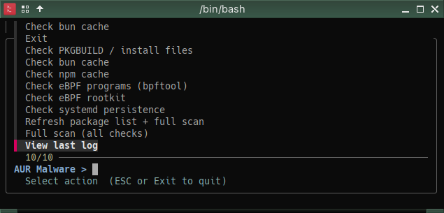

# Personal setup — Mabox Linux

Full overview of how this fork is deployed and how the pieces connect.

## Components

| Component | Package / Source | Purpose |
|-----------|-----------------|---------|
| `aur_check-v2.sh` | [musqz/aur-malware-check](https://github.com/musqz/aur-malware-check) (fork of [lenucksi/aur-malware-check](https://github.com/lenucksi/aur-malware-check)) | Main scanner — known-bad packages, pacman logs, systemd persistence (incl. drop-ins + timers), eBPF rootkit, npm/bun/yarn/pnpm cache, PKGBUILD obfuscation (incl. base64/eval/printf/varsplit), loaded-eBPF enumeration (`bpftool`), `ld.so.preload` injection, XDG autostart + shell RC persistence, kernel module / DKMS audit |
| `aur_malware_gui.sh` | [musqz/aur-malware-check](https://github.com/musqz/aur-malware-check) | yad GUI — grouped menu with per-session status column (✅/⚠/❌/?), polkit auth for root checks, streaming output window |
| `aur_malware_menu.sh` | [musqz/aur-malware-check](https://github.com/musqz/aur-malware-check) | fzf TUI menu — run individual checks or view last log from the notification |
| `traur` | [AUR: traur](https://aur.archlinux.org/packages/traur) | Trust scan — checks AUR package maintainer reputation and flags suspicious accounts |
| `aurscan` | [manticore-projects/aurscan](https://github.com/manticore-projects/aurscan) | LLM-based pre-install PKGBUILD scanner using Claude — proactive check before installing an AUR package |
| `notify-send.sh` | [vlevit/notify-send.sh](https://github.com/vlevit/notify-send.sh) — [AUR: notify-send.sh](https://aur.archlinux.org/packages/notify-send.sh) | Drop-in replacement for `notify-send` with action button support — enables the **Show Menu** button on the alert |
| `yad` | official repos | GTK dialog toolkit used by `aur_malware_gui.sh` |
| `polkit` / `pkexec` | official repos | Graphical privilege escalation for root-requiring checks (eBPF, kmod) in the GUI |
| `fzf` | [junegunn/fzf](https://github.com/junegunn/fzf) — official repos | Menu picker used by `aur_malware_menu.sh` |
| `libnotify` | official repos | Fallback notification backend when `notify-send.sh` is not installed |
| `bpftool` | `bpf` — official repos | Enumerates loaded eBPF programs for `--check-bpftool` |
| terminal emulator | your preferred terminal | Opened by the **Show Menu** button — auto-detected via `$TERMINAL`, or falls back to `kitty` → `alacritty` → `xterm` → `gnome-terminal` → `xfce4-terminal` |

## How the pieces connect

```
systemd timer (weekly + on boot)
    └── aur_check-v2.sh --refresh --full --all-time
            ├── [1]  currently installed foreign packages
            ├── [2]  historical pacman logs
            ├── [3]  systemd persistence (services, drop-ins, timers)
            ├── [4]  eBPF rootkit traces (/sys/fs/bpf/hidden_*)
            ├── [5]  npm cache
            ├── [6]  bun cache
            ├── [6b] yarn cache
            ├── [6c] pnpm cache
            ├── [7]  PKGBUILD / install file scan (obfuscation-aware)
            ├── [8]  loaded eBPF programs via bpftool (stealth hook types)
            ├── [9]  ld.so.preload injection
            ├── [10] XDG autostart + shell RC persistence
            └── [11] kernel module / DKMS audit (needs root)
                    │
                    └── exit code 2 (infected)?
                            └── notify-send.sh → critical alert + [Show Menu] button
                                    └── terminator opens aur_malware_menu.sh
                                            └── fzf menu: pick a check or view log
                                                    └── returns to menu after each run

aur_malware_gui.sh (on-demand — desktop shortcut or app launcher)
    └── yad list menu with per-session status column
            ├── standard checks run as user
            └── root checks (eBPF, bpftool, kmod) → pkexec → polkit auth → root-helper
                    └── streams output live, updates status on close

traur (manual — trust check on a specific package)
    └── checks AUR maintainer reputation before installing

aurscan (manual — before installing any AUR package)
    └── scans PKGBUILD with Claude LLM before yay installs it
```

### The yad GUI (`aur_malware_gui.sh`)

Run from a desktop shortcut or app launcher — grouped menu with a per-session status column, polkit auth for root-requiring checks, and a live streaming output window:


### The fzf menu (`aur_malware_menu.sh`)

Opened by the **Show Menu** notification button (or directly from a terminal) — pick a single check to run, or view the last scan log:



## When each tool runs

| Tool | When | Trigger |
|------|------|---------|
| `aur_check-v2.sh` | Weekly + on boot (catches missed runs) | systemd timer with `Persistent=true` |
| `aur_malware_gui.sh` | On demand | Desktop shortcut / app launcher |
| `aur_malware_menu.sh` | On demand | **Show Menu** notification button or directly from terminal |
| `traur` | Before each AUR install | Manual — check maintainer reputation |
| `aurscan` | Before each AUR install | Manual — run before `yay -S <pkg>` |

## Install locations

```
~/.local/bin/aur-malware-check.sh     # main script
~/.local/bin/aur_malware_menu.sh      # fzf menu script
~/.local/bin/aur_malware_gui.sh       # yad GUI script

~/.config/aur-malware-check/
    ├── package_list.txt              # refreshed weekly via --refresh
    ├── malicious_npm_packages.txt    # static list, auto-seeded on first run
    └── dkms_allowlist.conf           # DKMS modules to skip in --check-kmod

~/.config/systemd/user/
    ├── aur-malware-check.service
    └── aur-malware-check.timer

# system components — installed by ./install.sh --system (requires sudo)
/usr/lib/aur-malware-check/
    ├── aur-malware-check.sh          # root-accessible copy of the main script
    └── root-helper                   # pkexec target (validates flags, restores XDG env)
/usr/share/polkit-1/actions/
    └── org.aur-malware-check.policy  # polkit policy allowing GUI to call root-helper
```

## Dependencies

```bash
# Official repos
# bpf provides bpftool (--check-bpftool); yad is the GUI toolkit
sudo pacman -S fzf libnotify bpf yad polkit

# AUR
yay -S notify-send.sh traur

# aurscan — GitHub only, no AUR package
# clone from https://github.com/manticore-projects/aurscan and follow its README
```

## Systemd unit files

See [systemd.md](systemd.md) for the full service and timer contents.

## Reinstalling from scratch

```bash
# 1. Clone the fork
git clone https://github.com/musqz/aur-malware-check.git ~/Github/aur-malware-check

# 2. Install dependencies (bpf provides bpftool for --check-bpftool; yad for GUI)
sudo pacman -S fzf libnotify bpf yad polkit
yay -S notify-send.sh traur

# aurscan — GitHub only, no AUR package
git clone https://github.com/manticore-projects/aurscan.git
# see its README for install instructions

# 3. Run install script (installs to ~/.local/bin by default)
bash ~/Github/aur-malware-check/install.sh

# Also install root helper + polkit policy (enables eBPF/kmod checks in the GUI)
bash ~/Github/aur-malware-check/install.sh --system

# 4. Run a first scan with package list refresh
aur-malware-check.sh --refresh --full --all-time
```
