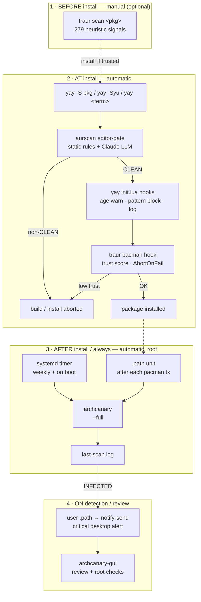

# Overview — how the stack fits together

A one-screen map of the AUR security stack. For the full reference (every
component, install locations, reinstall steps) see [my-setup.md](my-setup.md).

The whole stack hangs off the **AUR package lifecycle**: checks happen *before*
you install, *at* install time, *after* install (continuously), and *on
detection*.

## At a glance

| Phase | Tool | Trigger | Automatic? | Catches |
|-------|------|---------|:---------:|---------|
| 1 · Before (optional) | `traur scan <pkg>` | You run it before installing | ✗ manual | Maintainer reputation, PKGBUILD heuristics (279 signals) |
| 2 · At install | `aurscan` editor-gate | Every `yay` build (transparent) | ✓ auto | Novel / obfuscated payloads — Claude reads each PKGBUILD before build |
| 2 · At install | yay `init.lua` hooks | Every `yay` install/upgrade | ✓ | Known campaign signatures, stale-rewrite upgrades (offline) |
| 2 · At install | `traur` pacman hook | Every pacman install/upgrade (incl. repo pkgs) | ✓ auto | Maintainer/metadata trust score; aborts the transaction on fail |
| 3 · After / always | `archcanary` | systemd timer (weekly + boot) + `.path` (after each pacman tx) | ✓ root | Known-bad packages, systemd/eBPF/npm persistence, rootkit traces |
| 4 · On detection | notifier → GUI | `last-scan.log` flips to INFECTED | ✓ | Surfaces a result; review is manual |

## Read this first

- **Nothing here removes malware.** Every layer *detects and reports* — remediation is left to you. See [Read-only by design](../README.md).
- **Pre-install vs post-install.** Phases 1–2 try to stop a bad package before it lands; phase 3 catches anything already installed (or installed before the stack existed).
- **Defence in depth.** `aurscan` (with Claude) catches novel/obfuscated payloads; the offline Lua hooks catch known campaign signatures and run even with no network; `traur` (a pacman PreTransaction hook, also runnable by hand) adds maintainer/metadata trust signals no static scan sees and can abort the install. None replaces the others.

## Go deeper

| Want… | See |
|-------|-----|
| Every component + how it's wired | [my-setup.md](my-setup.md) |
| systemd unit file contents | [systemd.md](systemd.md) |
| Benign signals that fire anyway | [false-positives.md](false-positives.md) |
