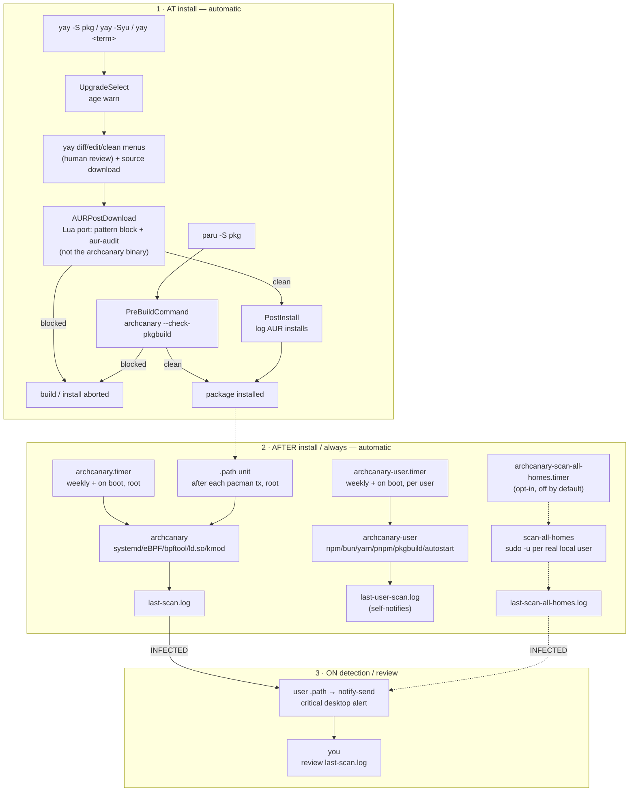

# Overview — how the stack fits together

A one-screen map of the AUR security stack. For the full reference (every
component, install locations, reinstall steps) see [my-setup.md](my-setup.md).

The whole stack hangs off the **AUR package lifecycle**: checks happen *at*
install time, *after* install (continuously), and *on detection*.

```mermaid
flowchart TD
    subgraph AT["1 · AT install — automatic"]
        U["yay -S pkg / yay -Syu / yay &lt;term&gt;"] --> SEL["UpgradeSelect<br/>age warn"]
        SEL --> REV["yay diff/edit/clean menus<br/>(human review) + source download"]
        REV --> PDL["AURPostDownload<br/>Lua port: pattern block + aur-audit<br/>(not the archcanary binary)"]
        UP["paru -S pkg"] --> PBC["PreBuildCommand<br/>archcanary --check-pkgbuild"]
        PDL -->|blocked| AB["build / install aborted"]
        PBC -->|blocked| AB
        PDL -->|clean| POST["PostInstall<br/>log AUR installs"]
        PBC -->|clean| OK["package installed"]
        POST --> OK
    end

    subgraph AFTER["2 · AFTER install / always — automatic"]
        TIM["archcanary.timer<br/>weekly + on boot, root"] --> SCAN["archcanary<br/>systemd/eBPF/bpftool/ld.so/kmod"]
        PTH[".path unit<br/>after each pacman tx, root"] --> SCAN
        SCAN --> LOG["last-scan.log"]

        UTIM["archcanary-user.timer<br/>weekly + on boot, per user"] --> USCAN["archcanary-user<br/>npm/bun/yarn/pnpm/pkgbuild/autostart"]
        USCAN --> ULOG["last-user-scan.log<br/>(self-notifies)"]

        SAHTIM["archcanary-scan-all-homes.timer<br/>(opt-in, off by default)"] -.-> SAH["scan-all-homes<br/>sudo -u per real local user"]
        SAH -.-> SAHLOG["last-scan-all-homes.log"]
    end

    subgraph ALERT["3 · ON detection / review"]
        NOT["user .path → notify-send<br/>critical desktop alert"]
        LOG -->|INFECTED| NOT
        SAHLOG -.->|INFECTED| NOT
        NOT --> REVIEW["you<br/>review last-scan.log"]
    end

    OK -.-> PTH
```

## At a glance

| Phase | Tool | Trigger | Automatic? | Catches |
|-------|------|---------|:---------:|---------|
| 1 · At install | yay `init.lua` hooks | Every `yay` install/upgrade | ✓ | Known campaign signatures, stale-rewrite upgrades, aur-audit black/red (offline + live feed) |
| 1 · At install | paru `PreBuildCommand` hook | Every `paru` build | ✓ | Same obfuscation patterns as yay's hook (via `archcanary --check-pkgbuild`, scoped to that package) — no aur-audit lookup yet |
| 2 · After / always | `archcanary` | systemd timer (weekly + boot) + `.path` (after each pacman tx) | ✓ root | Known-bad packages, systemd/eBPF/npm persistence, rootkit traces |
| 2 · After / always | `archcanary-user` | systemd `--user` timer (weekly + boot) | opt-in, per user | npm/bun/yarn/pnpm/pkgbuild caches, autostart — for whoever enables it |
| 2 · After / always | `archcanary-scan-all-homes` | systemd timer, weekly | opt-in, off by default | Same as above, for every real local user — not just whoever opted in |
| 3 · On detection | notifier → review | `last-scan.log`/`last-scan-all-homes.log` flips to INFECTED | ✓ | Surfaces a result; review is manual |

## Read this first

- **Nothing here removes malware.** Every layer *detects and reports* — remediation is left to you. See [Read-only by design](../README.md).
- **Pre-install vs post-install.** Phase 1 tries to stop a bad package before it lands; phase 2 catches anything already installed (or installed before the stack existed).
- **Defence in depth.** The offline yay Lua hooks (or paru's `PreBuildCommand` hook) catch known campaign signatures and run even with no network — a pre-build layer with no dependency on trusting a third party's live judgment.

## Go deeper

| Want… | See |
|-------|-----|
| Every component + how it's wired | [my-setup.md](my-setup.md) |
| systemd unit file contents | [systemd.md](systemd.md) |
